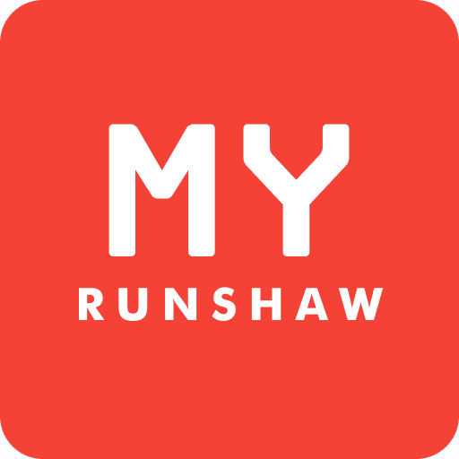

<center></center>
<center><h1>My Runshaw - v2 API</h1></center>

## Overview

This repo contains the rebuilt backend API and background workers for the [My Runshaw app](https://github.com/Dragon863/myrunshaw/). It is designed as a modular monolith using "Clean Architecture" (explained well [here](https://learn.microsoft.com/en-us/dotnet/architecture/modern-web-apps-azure/common-web-application-architectures#clean-architecture)) for separation of concerns, maintainability, and testability. I created it to replace the legacy API which used a combination of FastAPI and Appwrite distributed services which was becoming a maintainence burden, and the new auth approach only allows Microsoft Entra ID (Azure AD) users to log in, removing confusion from students who expected their college psasword to work.

> [!WARNING]
> This next-gen backend is NOT a drop-in replacement for the previous one! While most endpoints remain the same for ease of migration, some have been removed, added or now return extra data.

## Architecture

I've made an effort to structure the solution in a way that clearly separates concerns and follows the principles of Clean Architecture. The solution is organized into several projects, each with a specific responsibility:
```
MyRunshaw.slnx
└── src/
    ├── MyRunshaw.Api/            - Presentation layer (HTTP endpoints, Controllers, Auth middleware)
    ├── MyRunshaw.Workers/        - Background tasks (Quartz.NET scheduled jobs & HostedServices)
    ├── MyRunshaw.Infrastructure/ - External integrations (EF Core, PostgreSQL, Redis, Cloudflare R2, OneSignal)
    ├── MyRunshaw.Application/    - Use cases, business rules, interfaces, and services
    ├── MyRunshaw.Domain/         - Pure domain entities, enums, and common types
    └── MyRunshaw.Contracts/      - Data Transfer Objects (DTOs) shared across boundaries
```
### Technology Stack

*   **Runtime:** .NET 10
*   **Database:** PostgreSQL (Entity Framework Core)
*   **Caching:** Redis (IDistributedCache)
*   **Object Storage:** Cloudflare R2 (S3-compatible)
*   **Authentication:** Microsoft Entra ID -> Custom JWT
*   **Background Jobs:** Quartz.NET (scheduled tasks) + BackgroundService (polling only)
*   **Observability:** OpenTelemetry (traces, metrics, logs)

---

## Getting Started

### Prerequisites

*   [.NET 10 SDK](https://dotnet.microsoft.com/download)
*   [Docker](https://docs.docker.com/get-docker/) (for local Postgres, Redis, and Aspire Dashboard)
*   `dotnet-ef` global tool (for migrations):
    ```bash
    dotnet tool install --global dotnet-ef
    ```

## Local development 

I'm open to any bug fixes, improvements, or feature requests! Before developing any major changes, please contact me though - if it's not something that can feasibly adopted into the app, it would be a shame for too much development time to be sunk into it. 

### Setup
If you want to run the backend locally for development, follow these steps:

1.  **Clone the repository:**
    ```bash
    git clone https://github.com/dragon863/MyRunshawApi
    cd MyRunshawApi
    ```

2.  **Start local dependencies:**
    If you are running outside of Docker, you will need a local PostgreSQL and Redis instance, and should update appsettings to point to them.

3.  **Configure User Secrets:**
    To avoid storing secrets in configuration files, you might wish to use .NET User Secrets in the Api and worker projects ,for example:
    ```bash
    cd src/MyRunshaw.Api
    dotnet user-secrets set "ConnectionStrings:DefaultConnection" "Host=localhost;Database=myrunshaw_db;Username=postgres;Password=[pwd]"
    ```

4.  **Run Database Migrations:**
    Apply migrations to your local PostgreSQL instance:
    ```bash
    dotnet ef database update --project src/MyRunshaw.Infrastructure --startup-project src/MyRunshaw.Api
    ```
    This will create the necessary tables and seed initial data.

5.  **Run the Applications:**
    The API will start the background workers automatically, so you only need to run the API project:
    ```bash
    # Run the API
    dotnet run --project src/MyRunshaw.Api
    ```

6.  **Access the Documentation:**
    Once running, open `http://localhost:5267/swagger` in your browser to access the OpenAPI/Swagger interface.

---

## Background workers

The background worker project `MyRunshaw.Workers` manages tasks that run in isolation from the main API.

*   **BusArrivalScraperWorker** (`BackgroundService`): Polls live bus arrivals at a fixed configurable interval
*   **TimetableDailySyncJob** (`Quartz`): Runs daily at 7:30 AM to update all student timetables from Student Portal
*   **BusRouteScraperJob** (`Quartz`): Runs weekly to refresh standard bus route listings and map URLs

---

## Production deployment

This application is designed to be built and deployed using [Docker](https://www.docker.com/).

### Recommended production environment
*   **Database:** I'd highly recommend using PostgreSQL running externally. You will likely need to edit `pg_hba.conf` to allow connections from within docker networks and `postgresql.conf`'s listen address too.
*   **Cache:** Containerised Redis - included in the provided docker compose file.
*   **API/Worker Hosting:** In my opinion, anything beyond Docker Compose is overkill at this small scale

### Deployment steps

1.  Copy the `example.appsettings.Production.json` file to `appsettings.Production.json` and fill in your production secrets (e.g., database connection string, Redis connection, JWT secret, Entra ID credentials, S3 credentials).
2.  Start the containers:
    ```bash
    docker compose up -d --build
    ```

The Docker image does not need `appsettings.Production.json` baked into it. Compose mounts that file at runtime, and `.dockerignore` keeps it out of the build context so the image cannot accidentally capture local secrets. Locally, the API and workers still use the normal ASP.NET Core config order: `appsettings.json`, `appsettings.{Environment}.json`, then environment variables or user secrets. That means you can keep testing with a committed example file and override only the values that differ on your machine.

---

## Monitoring and Observability

All services are integrated with OpenTelemetry. They emit logs, metrics, and traces natively over the OTLP protocol.

In development, it's easiest to use the .NET Aspire Dashboard on `http://localhost:18888`, but you'll need to run this with docker to have it standalone:
```bash
docker run --rm -it -p 18888:18888 -p 4317:18889 -p 4318:18890 -d --name aspire-dashboard \
    mcr.microsoft.com/dotnet/aspire-dashboard:latest
``` 
You can also use any OTLP-compatible collector or backend - hopefully once Posthog's trace support is out of alpha that would integrate nicely since it's already in use for the flutter app.